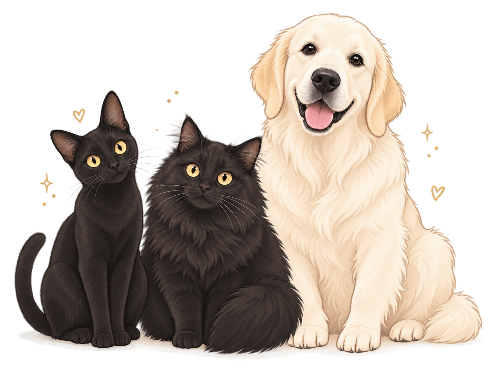
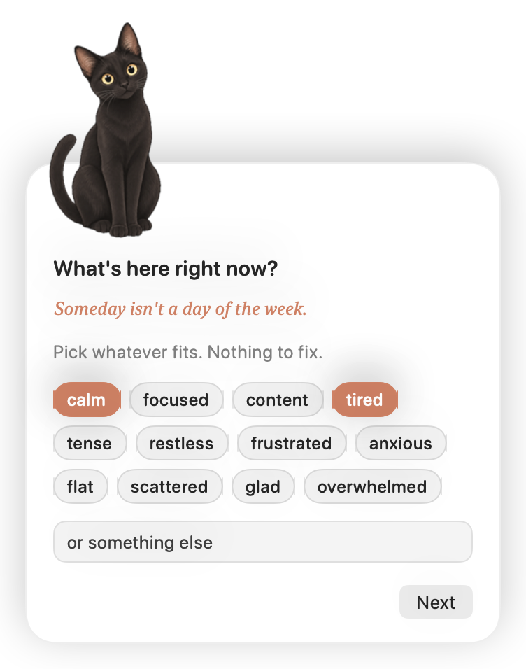

# Gratitude Buddy

A small macOS menu-bar companion. Roughly once an hour one of three buddies slides up: Toki (a fluffy black cat),
Skwisgaar (a sleek black cat), or Appa (a cream golden retriever), taking turns. It floats up in the bottom-right corner, above whatever you're working on and asks two things:

1. **What's here right now?** Tap a few feeling words, or type your own.
2. **Anything to be grateful for, right now?** Something small is enough. "Nothing today" is a fine answer.

Then it says thanks and slides away.

<p align="center"></p>
<p align="center"></p>

## Privacy

Everything stays on your Mac. Each completed check-in is appended to a plain Markdown file at
`~/Library/Application Support/Gratitude Buddy/journal.md`, which you own and can edit or delete.
Nothing is sent anywhere, and dismissing a check-in stores nothing.

## Build and run

Needs the Xcode command-line tools (Swift 5.9+, macOS 14+). No Xcode project required.

```bash
./build.sh
open "build/Gratitude Buddy.app"
```

To keep it around, drag `build/Gratitude Buddy.app` into `/Applications` and turn on **Open at login**
from the menu.

## The menu (the paw in your menu bar)

- **Next check-in around …** shows when it will appear next.
- **Check in now** brings the buddy up immediately.
- **Snooze 15 minutes** and **Pause until tomorrow** (resumes at 9 am).
- **Meet the buddies** shows all three side by side. **Check in with** picks one by name.
- **Open journal** opens the Markdown file.
- **Soft sound** toggles the quiet pop on arrival.
- **Open at login** registers it as a login item.

## Behaviour details

- Interval is random between 50 and 70 minutes, so it never feels like a metronome.
- "Not now" brings it back in 30 minutes instead of a full hour.
- Esc dismisses. The panel never steals focus from the app you're in, but you can type into it.
- If the Mac was asleep past the scheduled time, it waits five minutes after wake.
- If you've been away from the keyboard for more than five minutes, it waits until you're back.
- If it sits ignored for 15 minutes it slides away on its own.
- Drag the card anywhere by its background.
- The card is always light, whatever your system appearance, because the illustrations are drawn for white.
- About one check-in in three carries a short reflection on the feelings step, a gentle reminder that time is
  finite. The lines live in `Sources/CheckInModel.swift` if you want to add your own.

## Tweaking

- Feeling words, greetings, and copy live in `Sources/CheckInModel.swift` and `Sources/BuddyView.swift`.
- The buddies are illustrations in `Resources/buddies/`, one PNG per character and mood
  (`toki-neutral.png`, `toki-curious.png`, `toki-happy.png`, and likewise for `skwisgaar` and `appa`).
  Replace a file to change the art. `Sources/BuddyFace.swift` holds a drawn fallback used if a file is missing,
  and `BuddyKind.next()` decides whose turn it is. The app icon is rendered from Toki's illustration by `Tools/MakeIcon`.
- Timing lives in `Sources/Scheduler.swift`.
- `./preview.sh` renders all three buddies in every mood, plus each step of the card, to `build/preview/` so you can check the design without
  waiting for a pop-up.
- For a quick test of the real thing: `BUDDY_INTERVAL_SECONDS=15 "build/Gratitude Buddy.app/Contents/MacOS/Gratitude Buddy"`.
